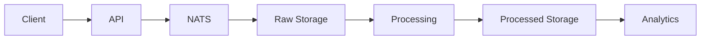

# Event Collection System Implementation Plan

## Phase 1: Database Schema Setup

### 1.1 ClickHouse Tables

#### Raw Events Table
```sql
CREATE TABLE IF NOT EXISTS raw_events (
    -- Primary event identification
    event_id UUID,
    received_at DateTime64(9) CODEC(Delta, ZSTD(3)),
    timestamp DateTime64(9) CODEC(Delta, ZSTD(3)),
    
    -- Event classification
    platform LowCardinality(String),
    event_type LowCardinality(String),
    event_name String,
    
    -- Identity tracking
    session_id UUID,
    user_id UUID NULL,
    
    -- Event data
    properties JSON,
    context JSON,
    raw_data String CODEC(ZSTD(3)),
    
    -- Processing metadata
    processed_at DateTime64(9) NULL,
    processing_status Enum8('pending' = 0, 'processed' = 1, 'failed' = 2) DEFAULT 'pending',
    error_message String NULL,
    
    -- Partitioning and ordering
    _partition_key String MATERIALIZED toYYYYMM(timestamp)
) ENGINE = MergeTree()
PARTITION BY _partition_key
ORDER BY (timestamp, event_type, event_id)
SETTINGS index_granularity = 8192;
```

#### Processed Events Table
```sql
CREATE TABLE IF NOT EXISTS processed_events (
    -- Event identification
    event_id UUID,
    raw_event_id UUID,
    processed_at DateTime64(9) CODEC(Delta, ZSTD(3)),
    
    -- Event classification
    platform LowCardinality(String),
    event_type LowCardinality(String),
    event_name String,
    
    -- Identity tracking
    session_id UUID,
    user_id UUID NULL,
    
    -- Processed data
    properties JSON,
    metrics JSON,
    
    -- Partitioning and ordering
    _partition_key String MATERIALIZED toYYYYMM(processed_at)
) ENGINE = MergeTree()
PARTITION BY _partition_key
ORDER BY (processed_at, event_type, event_id)
SETTINGS index_granularity = 8192;
```

### 1.2 QuestDB Tables (for metrics)
```sql
CREATE TABLE metrics (
    ts TIMESTAMP,
    metric_name SYMBOL,
    value DOUBLE,
    tags SYMBOL[],
    properties JSON
) timestamp(ts) PARTITION BY DAY;
```

## Phase 2: API Implementation

### 2.1 FastAPI Endpoints Structure
```
app/
├── api/
│   ├── __init__.py
│   ├── events/
│   │   ├── __init__.py
│   │   ├── models.py       # Pydantic models
│   │   ├── routes.py       # API routes
│   │   └── service.py      # Business logic
│   └── common/
│       ├── __init__.py
│       ├── models.py       # Common models
│       └── utils.py        # Utilities
├── core/
│   ├── __init__.py
│   ├── config.py          # Configuration
│   └── logging.py         # Logging setup
└── services/
    ├── __init__.py
    ├── clickhouse.py      # ClickHouse client
    ├── nats.py           # NATS client
    └── questdb.py        # QuestDB client
```

### 2.2 Key API Endpoints
1. Batch Event Ingestion
   ```python
   POST /api/v1/events/batch
   - High throughput
   - Validation
   - Async processing
   ```

2. Single Event Ingestion
   ```python
   POST /api/v1/events
   - Real-time processing
   - Immediate feedback
   ```

3. Event Query API
   ```python
   GET /api/v1/events
   - Filtered queries
   - Pagination
   - Field selection
   ```

## Phase 3: Processing Pipeline

### 3.1 Dagster Pipeline Structure
```
app/dagster/
├── __init__.py
├── assets/
│   ├── __init__.py
│   ├── raw_events.py
│   └── processed_events.py
├── resources/
│   ├── __init__.py
│   ├── clickhouse.py
│   └── nats.py
└── sensors/
    ├── __init__.py
    └── event_sensor.py
```

### 3.2 Processing Steps
1. Event Validation
   - Schema validation
   - Data type checking
   - Required field verification

2. Event Enrichment
   - IP geolocation
   - User agent parsing
   - Device information
   - Time zone normalization

3. Event Processing
   - Session stitching
   - User journey tracking
   - Metric computation
   - Anomaly detection

### 3.3 Data Flow


## Implementation Phases

### Phase 1: Foundation (Current Focus)
1. Set up ClickHouse schemas
2. Implement basic API endpoints
3. Create simple processing pipeline

### Phase 2: Enhancement
1. Add validation and enrichment
2. Implement batch processing
3. Add error handling and retry logic

### Phase 3: Optimization
1. Add caching layers
2. Implement rate limiting
3. Add monitoring and alerting

## Next Steps

1. Create ClickHouse tables
2. Implement basic API structure
3. Set up event validation
4. Create simple processing pipeline
5. Add basic monitoring

This plan will be updated as implementation progresses and requirements evolve. 